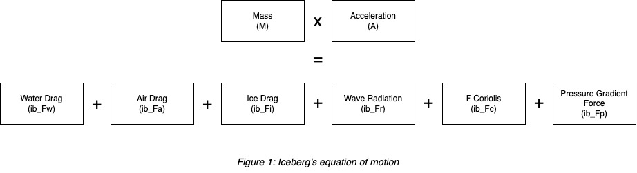
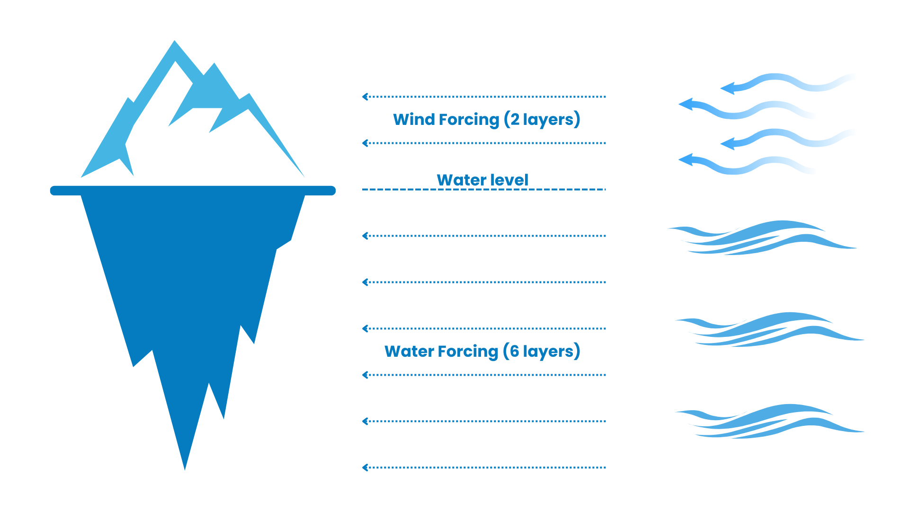

Advection
=========

This is the module that simulate the movement of the iceberg using external conditions and physical characteristic of
the ocean.

Dynamical Framework
^^^^^^^^^^^^^^^^^^^^^^^^^^^

| The motion of the iceberg (dragging force) is modeled using Newton’s second law, with forces including water drag, air drag, Coriolis, and pressure gradients as in Figure 1. The motion is calculated in both horizontal (ib_FU) and vertical (ib_FV) directions.

| By default, the iceberg's distance traveled and the dragging force's velocity are calculated using the following formulas:

.. math::

   \text{dist}_i = \frac{%
       \text{ib_uVel}(n) \cdot \left( \frac{\Delta t}{\Delta t_{\text{ice}}} \right)
       + 0.5 \cdot \text{ib_FU} \cdot \left( \frac{\Delta t}{\Delta t_{\text{ice}}} \right)^2%
   }{\text{ib_dxC}}

.. math::

   \text{dist}_j = \frac{%
       \text{ib_vVel}(n) \cdot \left( \frac{\Delta t}{\Delta t_{\text{ice}}} \right)
       + 0.5 \cdot \text{ib_FV} \cdot \left( \frac{\Delta t}{\Delta t_{\text{ice}}} \right)^2%
   }{\text{ib_dyC}}

.. math::

   \text{ib_uVel}(n) = \text{ib_uVel}(n) + \text{ib_FU} \cdot \left( \frac{\Delta t}{\Delta t_{\text{ice}}} \right)

.. math::

   \text{ib_vVel}(n) = \text{ib_vVel}(n) + \text{ib_FV} \cdot \left( \frac{\Delta t}{\Delta t_{\text{ice}}} \right)

| Notations:

- Δt: Model tracer timesteps (as set in the ``namelist/data`` file).
- Δt\ :sub:`ice`\: The number of iceberg timesteps to every one model tracer timestep (as set in ``namelist/data.iceberg`` file). The default is 10 timesteps.
- ``ib_FU``: The horizontal dragging force.
- ``ib_FV``: The vertical dragging force.
- ``ib_dxC``: interpolated spacing of dx at iceberg.
- ``ib_dyC``: interpolated spacing of dy at iceberg.

Drag Forces
^^^^^^^^^^^^^^^^

The drag forces are a sum of the forces acting on vertical walls (form drag) and horizontal surfaces (skin drag), determined by the general relationship:

.. math::

   F_x = 0.5 \cdot \rho_x \cdot \left[ C_{xv} \cdot A_v + C_{xh} \cdot A_h \right] \cdot |V_x - V_i| \cdot (V_x - V_i)

where:

- The subscript :math:`x` denotes the medium:

 - :math:`a` for atmosphere
 - :math:`w` for water (ocean)
 - :math:`i` for sea ice

- :math:`v` and :math:`h` refer to:

 - :math:`v`: vertical (form drag on side walls)
 - :math:`h`: horizontal (skin drag on the bottom)

Note: There is no horizontal drag (:math:`C_{ih}` term) applied for sea ice.

Water Drag Force
^^^^^^^^^^^^^^^^^^^^^

- The thickness of sea ice is considered in the iceberg's draught at the surface, so that there is **no water drag force** applied where sea ice exists in the model (Martin and Adcroft, 2010).

- For the **bottom of the iceberg**, horizontal drag is included to represent skin drag effects (Martin and Adcroft, 2010).

- Icebergs are assumed to travel with their **long axis (length) aligned parallel** to the direction of the water velocity, which influences the projected area used in the drag calculation.

.. _Iceberg Keel Model:

Iceberg Keel Model
^^^^^^^^^^^^^^^^^^^^^

Calculate shape of iceberg keel (``ib_keel``) based on second order polynomial fit to the top 8 levels of the keel model of
Barker et al. 2004) ``ib_keel`` is a fractional value of the absolute length at each depth. Multiply ``ib_keel`` by ``ib_perpL`` to
get an actual size (meters) at each level in the model. The keel above and below water has the general shape:

The keel model will give a reduction in surface area over
the standard tabular shape below the waterline. The keel
area is ~77% of a tabular shape. This also alters
the mass of the iceberg. Note that this option will also
change the shape of the iceberg above the waterline to a two-layer sail that decreases in size with height.

| **Note:** Keel model only used when iceberg thickness > 30m to avoid prescribing unrealistic keel shapes. Below 30m thickness icebergs are assumed tabular (``ib_keel`` = **1**)

The iceberg keel depth is computed based on the number of vertical levels the iceberg penetrates into the water column, denoted as ``ib_nlvl``. This is first converted to a floating-point value:

.. math::

   \text{ib_nlvl_rl} = \text{ib_nlvl} \cdot 1.0

Then, a scaled quantity :math:`\text{ib\_RL}` is computed from the level index :math:`k` and the number of vertical levels:

.. math::

   \text{ib_RL} = k \cdot \left( \frac{8.0}{\text{ib_nlvl_rl}} \right)

Finally, the iceberg keel depth (``ib_keel``) is estimated using a quadratic formula based on ``ib_RL``:

.. math::

   \text{ib_keel} = -0.025 \cdot \text{ib_RL}^2 + 0.164 \cdot \text{ib_RL} + 0.78

Here:

- :math:`\text{ib_nlvl}` is the number of vertical levels the iceberg extends below the surface.
- :math:`k` is the current vertical level index.
- :math:`\text{ib_keel}` gives the estimated keel depth (in meters or model units).

Multi Level Ocean Drag
^^^^^^^^^^^^^^^^^^^^^

| Consider ocean drag force at EVERY LEVEL in the ocean model that an iceberg penetrates. This is designed to give a more realistic advection pattern, compared to the purely surface ocean advection that is typically used in models.

| **Attention**: Depends on the set up in ``ICEBERG_OPTIONS.h`` file, the model can account for the multi-level

- If ``ALLOW_ICEBERG_MULTILEVEL`` is **ENABLED** , the model will calculate the water drag force using the keel model (Barker et al., 2004). (:ref:`Iceberg Keel Model`)

- If ``ALLOW_ICEBERG_MULTILEVEL`` is **DISABLED** OR ``USE_TABULAR_ICEBERGS`` is **ENABLED**, the iceberg's keel value ``ib_keel`` will be set to **1**

Water drag is calculated at each vertical level of the iceberg. The approach differs depending on whether the iceberg fully or partially penetrates the vertical cell.

For levels fully penetrated by the iceberg (i.e., :math:`k \ne \text{ib_nlvl}`), the vertical thickness of the layer is initialized as:

.. math::

   \text{thkR} = \Delta R_k

If sea ice is present at the surface (i.e., in the top model layer, :math:`k = 1`), its thickness is subtracted:

.. math::

   \text{if } k = 1 \text{ and } \text{ib_SIheff} < \text{thkR}, \quad \text{thkR} = \text{thkR} - \text{ib_SIheff}

If the resulting thickness is zero or negative, the model stops with an error.

The water drag force components in the x and y directions are then computed as:

.. math::

   \text{ib_FwU_z}(k) = 0.5 \cdot \rho_w \cdot C_{wv} \cdot \text{ib_perpL_x} \cdot \text{ib_keel} \cdot \text{thkR} \cdot V_r \cdot u_r

.. math::

   \text{ib_FwV_z}(k) = 0.5 \cdot \rho_w \cdot C_{wv} \cdot \text{ib_perpL_y} \cdot \text{ib_keel} \cdot \text{thkR} \cdot V_r \cdot v_r

For the bottom level of the iceberg (:math:`k = \text{ib_nlvl}`), which is only **partially penetrated**, the effective iceberg thickness in that cell is computed by subtracting the cumulative depth from the total iceberg draft:

.. math::

   \text{thkR} = \text{ib_dft} - \text{cumDepth}(k)

As with the top layer, sea ice is subtracted if present:

.. math::

   \text{if } k = 1 \text{ and } \text{ib_SIheff} < \text{thkR}, \quad \text{thkR} = \text{thkR} - \text{ib_SIheff}

If :math:`\text{thkR} \le 0`, the model stops.

In this case, drag is calculated as a combination of:
- **Form drag** on the vertical sides
- **Skin drag** on the horizontal bottom

The x and y component drag forces become:

.. math::

   \text{ib_FwU_z}(k) = 0.5 \cdot \rho_w \cdot \left(
       C_{wv} \cdot \text{ib_perpL} \cdot \text{ib_keel} \cdot \text{thkR}
       + C_{wh} \cdot \text{ib_wth} \cdot \text{ib_keel} \cdot \text{ib_lth} \cdot \text{ib_keel}
   \right) \cdot V_r \cdot u_r

Where:

- :math:`\rho_w` is water density
- :math:`C_{wv}` and :math:`C_{wh}` are vertical and horizontal drag coefficients
- :math:`V_r` is the relative velocity magnitude between water and iceberg
- :math:`u_r` and :math:`v_r` are the relative velocity components in x and y
- :math:`\text{ib_perpL}`, :math:`\text{ib_wth}`, and :math:`\text{ib_lth}` are iceberg geometry terms

